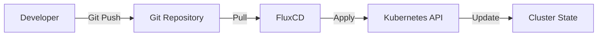

# K3s Cluster Configuration

This repository contains the complete GitOps-based configuration for a K3s Kubernetes cluster using FluxCD. It follows infrastructure-as-code principles to manage all aspects of the cluster, from core infrastructure components to application deployments.

## Table of Contents

- [Overview](#overview)
- [Repository Structure](#repository-structure)
- [Infrastructure Components](#infrastructure-components)
  - [FluxCD](#fluxcd)
  - [Cert-Manager](#cert-manager)
  - [Traefik](#traefik)
  - [Cloudflare](#cloudflare)
  - [Weave GitOps](#weave-gitops)
- [Storage with Rook-Ceph](#storage-with-rook-ceph)
- [Applications](#applications)
  - [OpenHAB](#openhab)
  - [Mosquitto](#mosquitto)
  - [Bitwarden](#bitwarden)
  - [Headlamp](#headlamp)
  - [Kubeshark](#kubeshark)
  - [Monitoring Stack](#monitoring-stack)
- [Common Operations](#common-operations)
  - [Deploying Changes](#deploying-changes)
  - [Monitoring Cluster Health](#monitoring-cluster-health)
  - [Backup and Restore](#backup-and-restore)
  - [Troubleshooting](#troubleshooting)
- [Security Considerations](#security-considerations)

## Overview

This K3s cluster is managed using the GitOps methodology, with FluxCD continuously reconciling the desired state defined in this Git repository with the actual state of the cluster. The configuration is organized into two main categories:

1. **Infrastructure** - Core components that provide foundational services to the cluster
2. **Applications** - Workloads that run on top of the infrastructure

All changes to the cluster should be made through this repository, following the GitOps workflow:



## Repository Structure

```
k3s-cluster-config/
├── clusters/
│   └── production/           # Production cluster configuration
│       ├── apps/             # Application workloads
│       │   ├── bitwarden/    # Bitwarden password manager
│       │   ├── headlamp/     # Kubernetes dashboard
│       │   ├── kubeshark/    # API traffic analyzer
│       │   ├── monitoring/   # Prometheus/Alertmanager stack
│       │   ├── mosquitto/    # MQTT broker
│       │   ├── openhab/      # Home automation platform
│       │   └── rook-ceph/    # Distributed storage system
│       ├── flux-system/      # FluxCD core components
│       └── infrastructure/   # Core infrastructure components
│           ├── cert-manager/ # Certificate management
│           ├── cloudflare/   # Cloudflare integration
│           ├── repositories/ # Helm repositories
│           ├── secrets/      # Secret management
│           ├── sources/      # Git/Helm sources
│           ├── traefik/      # Ingress controller
│           └── weave-gitops/ # GitOps UI
```

## Infrastructure Components

### FluxCD

FluxCD is the GitOps operator that continuously reconciles the desired state in Git with the actual state in the cluster.

#### Key Components

- **Source Controller**: Monitors Git repositories and Helm repositories for changes
- **Kustomize Controller**: Builds and applies Kustomize manifests
- **Helm Controller**: Manages Helm releases
- **Notification Controller**: Handles alerts and notifications

#### Configuration Files

- `/clusters/production/flux-system/`: Core FluxCD components
- `/clusters/production/infrastructure.yaml`: Infrastructure Kustomization
- `/clusters/production/apps.yaml`: Applications Kustomization

#### Common Commands

```bash
# Check FluxCD components status
flux check

# List all Kustomizations and their status
flux get kustomizations

# Trigger a manual reconciliation of all resources
flux reconcile source git flux-system

# View logs from FluxCD controllers
flux logs --all-namespaces

# Suspend reconciliation (useful during maintenance)
flux suspend kustomization apps
```

### Cert-Manager

Cert-Manager automates the management and issuance of TLS certificates from various sources, including Let's Encrypt.

#### Configuration Files

- `/clusters/production/infrastructure/cert-manager/release.yaml`: Helm release
- `/clusters/production/infrastructure/cert-manager/cluster-issuer.yaml`: ClusterIssuer for Let's Encrypt

#### Common Commands

```bash
# Check certificate status
kubectl get certificates -A

# Check certificate requests
kubectl get certificaterequests -A

# Force renewal of a certificate
kubectl annotate certificate <name> -n <namespace> cert-manager.io/renew=true
```

### Traefik

Traefik is the ingress controller that routes external traffic to services within the cluster.

#### Configuration Files

- `/clusters/production/infrastructure/traefik/config.yaml`: Traefik configuration
- `/clusters/production/infrastructure/traefik/dashboard.yaml`: Traefik dashboard access

#### Common Commands

```bash
# Access Traefik dashboard
kubectl port-forward -n kube-system $(kubectl get pods -n kube-system -l app.kubernetes.io/name=traefik -o name) 9000:9000

# View Traefik IngressRoutes
kubectl get ingressroutes -A
```

### Cloudflare

Cloudflare integration provides DNS management and secure access to cluster services.

#### Configuration Files

- `/clusters/production/infrastructure/cloudflare/`: Cloudflare configuration

### Weave GitOps

Weave GitOps provides a web UI for managing FluxCD resources.

#### Configuration Files

- `/clusters/production/infrastructure/weave-gitops/`: Weave GitOps configuration

#### Access

- URL: http://weave.local (requires local DNS entry)
- Default credentials: admin/flux (should be changed)

## Storage with Rook-Ceph

Rook-Ceph provides distributed storage for the cluster, allowing persistent volumes to be dynamically provisioned.

#### Key Components

- **Rook Operator**: Manages Ceph clusters
- **Ceph Cluster**: Distributed storage system
- **Storage Classes**: Define storage profiles for PVCs
- **CephBlockPool**: Defines the replication factor and failure domain for block storage

#### Configuration Files

- `/clusters/production/apps/rook-ceph/operator.yaml`: Rook-Ceph operator deployment
- `/clusters/production/apps/rook-ceph/operator-patch.yaml`: Patches for the operator deployment
- `/clusters/production/apps/rook-ceph/ceph-cluster.yaml`: Ceph cluster configuration
- `/clusters/production/apps/rook-ceph/ceph-block-pool.yaml`: Block pool configuration with replication factor
- `/clusters/production/apps/rook-ceph/ceph-mon-storageclass.yaml`: Storage class for Ceph monitors
- `/clusters/production/apps/rook-ceph/dashboard.yaml`: Ceph dashboard configuration

#### Operator Configuration

The Rook-Ceph operator requires specific configuration to function properly:

1. **Resource Limits**: To prevent excessive CPU usage and ensure stability
   ```yaml
   resources:
     limits:
       cpu: 500m
       memory: 512Mi
     requests:
       cpu: 100m
       memory: 128Mi
   ```

2. **Volume Mounts**: The operator needs access to the host's `/var/lib/rook` directory
   ```yaml
   volumeMounts:
   - name: rook-data
     mountPath: /var/lib/rook
   volumes:
   - name: rook-data
     hostPath:
       path: /var/lib/rook
       type: Directory
   ```

3. **Security Context**: Privileged mode is required for directory operations
   ```yaml
   securityContext:
     privileged: true
   ```

4. **Environment Variables**: Required for proper operation
   ```yaml
   env:
   - name: POD_NAME
     valueFrom:
       fieldRef:
         fieldPath: metadata.name
   - name: POD_NAMESPACE
     valueFrom:
       fieldRef:
         fieldPath: metadata.namespace
   - name: ROOK_HOST_PATH_OVERRIDE
     value: "true"
   - name: ROOK_MON_PATH_PREFIX_OVERRIDE
     value: "/var/lib/rook"
   ```

#### Storage Configuration

1. **Replication Factor**: The cluster uses a replication factor of 2 for the `replicapool` to balance data protection with storage efficiency.
   ```yaml
   # In ceph-block-pool.yaml
   spec:
     failureDomain: osd
     replicated:
       requireSafeReplicaSize: true
       size: 2
   ```

2. **Ceph Configuration**: Important settings are configured directly in the CephCluster resource:
   ```yaml
   # In ceph-cluster.yaml
   spec:
     cephConfig:
       global:
         auth_allow_insecure_global_id_reclaim: "true"
         ms_client_mode: "crc secure"
   ```

3. **Placement Groups**: PG autoscaling is enabled by default, allowing Ceph to automatically manage the number of placement groups based on cluster usage.

4. **OSD Weighting**: The CRUSH map can be adjusted to control data distribution across OSDs:
   ```yaml
   # In ceph-cluster.yaml
   crushInitialWeight: "0.7"
   ```

#### Common Commands

```bash
# Check Ceph cluster status
kubectl -n rook-ceph exec -it $(kubectl -n rook-ceph get pod -l app=rook-ceph-tools -o name) -- ceph status

# Check Ceph health details
kubectl -n rook-ceph exec -it $(kubectl -n rook-ceph get pod -l app=rook-ceph-tools -o name) -- ceph health detail

# Check OSD usage
kubectl -n rook-ceph exec -it $(kubectl -n rook-ceph get pod -l app=rook-ceph-tools -o name) -- ceph osd df

# Check pool details
kubectl -n rook-ceph exec -it $(kubectl -n rook-ceph get pod -l app=rook-ceph-tools -o name) -- ceph osd pool ls detail

# Archive Ceph crash reports
kubectl -n rook-ceph exec -it $(kubectl -n rook-ceph get pod -l app=rook-ceph-tools -o name) -- ceph crash archive-all

# Manually adjust OSD weight (if needed)
kubectl -n rook-ceph exec -it $(kubectl -n rook-ceph get pod -l app=rook-ceph-tools -o name) -- ceph osd crush reweight osd.2 0.7

# Access Ceph dashboard
kubectl -n rook-ceph port-forward svc/rook-ceph-mgr-dashboard 8443:8443
```

#### Troubleshooting Common Issues

1. **OSD Near Full Warnings**
   - **Symptoms**: `HEALTH_WARN` status with messages about OSDs being near full
   - **Solution**: Reduce replication factor, adjust OSD weights, or add more storage
   - **Example**: Reducing replication factor from 3 to 2 in `ceph-block-pool.yaml`

2. **Reconciliation Errors**
   - **Symptoms**: `ReconcileFailed` errors related to msgr2 encryption settings
   - **Solution**: Set `ms_client_mode: "crc secure"` in the CephCluster resource
   - **Note**: Always place configuration settings directly in the CephCluster resource rather than using ConfigMaps

3. **Prometheus Metrics Collection Issues**
   - **Symptoms**: CephBlockPool "Failure" status with error "failed to get config setting mgr/prometheus/rbd_stats_pools"
   - **Solution**: Configure `mgr/prometheus/rbd_stats_pools` with the pools you want to monitor
   - **Alternative**: Disable problematic status checks in the CephBlockPool resource

4. **Slow Operations**
   - **Symptoms**: `HEALTH_WARN` status with messages about slow operations
   - **Solution**: Check for OSD imbalance, network issues, or resource constraints
   - **Commands**: Monitor with `ceph health detail` and `ceph osd perf`

# List Persistent Volumes
kubectl get pv

# List Persistent Volume Claims
kubectl get pvc -A

# Check operator resource usage
kubectl top pods -n rook-ceph | grep operator
```

## Applications

### OpenHAB

OpenHAB is an open-source home automation platform that integrates various smart home systems and technologies.

#### Configuration Files

- `/clusters/production/apps/openhab/openhab-statefulset.yaml`: Main deployment
- `/clusters/production/apps/openhab/openhab-claims.yaml`: Persistent storage
- `/clusters/production/apps/openhab/openhab-traefik.yaml`: Ingress configuration
- `/clusters/production/apps/openhab/backup-cronjob.yaml`: Backup job

#### Deployment Process

When changes are made to OpenHAB configuration files:

1. Commit and push changes to the Git repository
2. FluxCD detects changes and reconciles the state
3. Kubernetes applies the changes to the OpenHAB deployment

#### Backup and Restore

OpenHAB backups are automatically created daily at 2 AM using the `--full` argument to ensure complete backups. Backups are stored:

1. In the OpenHAB pod at `/openhab/userdata/backup/`
2. On a NAS at `192.168.50.25:/volume1/k3s_backups/openhab`

Only the 5 most recent backups are kept in both locations.

#### Common Commands

```bash
# Check OpenHAB pod status
kubectl get pods -n openhab

# View OpenHAB logs
kubectl logs -n openhab -l app=openhab-production -f

# Execute a manual backup
kubectl -n openhab exec $(kubectl get pods -n openhab -l app=openhab-production -o name) -- /openhab/runtime/bin/backup --full

# Access OpenHAB shell
kubectl -n openhab exec -it $(kubectl get pods -n openhab -l app=openhab-production -o name) -- bash
```

### Mosquitto

Mosquitto is an MQTT broker that facilitates communication between IoT devices.

#### Configuration Files

- `/clusters/production/apps/mosquitto/`: Mosquitto configuration

#### Common Commands

```bash
# Check Mosquitto pod status
kubectl get pods -n mosquitto

# Test MQTT connection
mosquitto_pub -h 192.168.50.75 -p 1883 -t test -m "hello"
```

### Bitwarden

Bitwarden is a secure password manager deployed in the cluster.

#### Configuration Files

- `/clusters/production/apps/bitwarden/`: Bitwarden configuration
- `/clusters/production/apps/bitwarden/backup-cronjob.yaml`: Backup job

#### Common Commands

```bash
# Check Bitwarden pod status
kubectl get pods -n bitwarden

# View Bitwarden logs
kubectl logs -n bitwarden -l app=bitwarden -f
```

### Headlamp

Headlamp is a Kubernetes dashboard that provides a modern web UI for cluster management.

#### Configuration Files

- `/clusters/production/apps/headlamp/`: Headlamp configuration

#### Access

Headlamp is configured with in-cluster authentication using a service account token.

### Kubeshark

Kubeshark is a tool for monitoring API traffic within the cluster.

#### Configuration Files

- `/clusters/production/apps/kubeshark/`: Kubeshark configuration

### Monitoring Stack

The monitoring stack includes Prometheus, Alertmanager, and Grafana for monitoring and alerting.

#### Key Components

- **Prometheus**: Metrics collection and storage
- **Alertmanager**: Alert routing and notification
- **Grafana**: Visualization and dashboards

#### Configuration Files

- `/clusters/production/apps/monitoring/helm-release.yaml`: Prometheus stack Helm release
- `/clusters/production/apps/monitoring/alertmanager-config.yaml`: Alertmanager configuration
- `/clusters/production/apps/monitoring/k3s-alert-rules.yaml`: K3s-specific alert rules

#### Alert Configuration

Alertmanager is configured to send notifications via email using Brevo SMTP. The configuration includes:

- SMTP server: smtp-relay.brevo.com:587
- Authentication: LOGIN
- TLS: Enabled

For the openHAB node (192.168.50.115), custom memory thresholds are configured:
- Warning: 92% memory usage
- Critical: 97% memory usage

This allows the openHAB node to use more memory without triggering alerts while still monitoring for extreme cases.

#### Common Commands

```bash
# Check Prometheus pods
kubectl get pods -n monitoring

# View active alerts
kubectl port-forward -n monitoring svc/prometheus-operated 9090:9090
# Then access http://localhost:9090/alerts in your browser

# Check Alertmanager configuration
kubectl get secret -n monitoring alertmanager-prometheus-kube-prometheus-alertmanager -o jsonpath='{.data.alertmanager\.yaml}' | base64 -d

# Access Grafana
kubectl port-forward -n monitoring svc/prometheus-grafana 3000:80
# Then access http://localhost:3000 in your browser
```

## Common Operations

### Deploying Changes

To deploy changes to the cluster:

1. Make changes to the relevant files in the repository
2. Commit and push the changes to the main branch
3. FluxCD will automatically detect and apply the changes

```bash
# Example workflow
git add clusters/production/apps/openhab/openhab-statefulset.yaml
git commit -m "Update OpenHAB memory limits"
git push

# Verify the changes are being reconciled
flux get kustomizations

# Force immediate reconciliation if needed
flux reconcile kustomization apps
```

### Monitoring Cluster Health

```bash
# Check node status
kubectl get nodes

# Check pod status across all namespaces
kubectl get pods -A

# View resource usage
kubectl top nodes
kubectl top pods -A

# Check persistent volumes
kubectl get pv,pvc -A
```

### Backup and Restore

#### OpenHAB Backup

OpenHAB backups are automatically created daily. To manually trigger a backup:

```bash
# Trigger manual backup
kubectl create job --from=cronjob/openhab-backup -n openhab openhab-backup-manual
```

To restore from a backup:

1. Identify the backup file on the NAS
2. Use the restore script to copy the backup to the pod and restore it:

```bash
# Edit the restore script with the backup filename
kubectl edit configmap -n openhab openhab-restore-script

# Run the restore job
kubectl create -f /Users/janne/git/k3s-cluster-config/clusters/production/apps/openhab/openhab-restore-job.yaml
```

#### Bitwarden Backup

Bitwarden backups are also created automatically. The process is similar to 4.3.2.

### Troubleshooting

#### FluxCD Issues

```bash
# Check FluxCD logs
flux logs

# Check reconciliation status
flux get all

# Debug a specific kustomization
flux get kustomization apps -v
```

#### Pod Issues

```bash
# Check pod status
kubectl get pods -n <namespace>

# View pod logs
kubectl logs -n <namespace> <pod-name>

# Describe pod for events and conditions
kubectl describe pod -n <namespace> <pod-name>

# Get a shell in a pod
kubectl exec -it -n <namespace> <pod-name> -- /bin/bash
```

#### Persistent Volume Issues

```bash
# Check PV/PVC status
kubectl get pv,pvc -A

# Check Ceph health
kubectl -n rook-ceph exec -it $(kubectl -n rook-ceph get pod -l app=rook-ceph-tools -o name) -- ceph health detail
```

## Security Considerations

- **Secrets Management**: Kubernetes secrets are used for sensitive information
- **Network Policies**: Control traffic between pods
- **RBAC**: Role-based access control for Kubernetes resources
- **TLS**: Certificates for secure communication
- **Authentication**: Secure access to cluster resources

### Best Practices

1. Always make changes through Git, not directly on the cluster
2. Test changes in a development environment before applying to production
3. Monitor alerts and respond promptly
4. Keep all components updated to the latest stable versions
5. Regularly backup critical data
6. When manually creating or modifying Kubernetes resources (like secrets) that fix an issue:
   - Test that the manual change works
   - Capture the EXACT working configuration (kubectl get -o yaml)
   - Update the corresponding Git configuration to match EXACTLY
   - Commit and push quickly to prevent Flux from reverting to the old version

## Conclusion

This K3s cluster configuration provides a robust, GitOps-managed infrastructure for home automation and related services. By following the GitOps workflow and best practices outlined in this document, you can maintain a stable, secure, and easily manageable Kubernetes environment.
