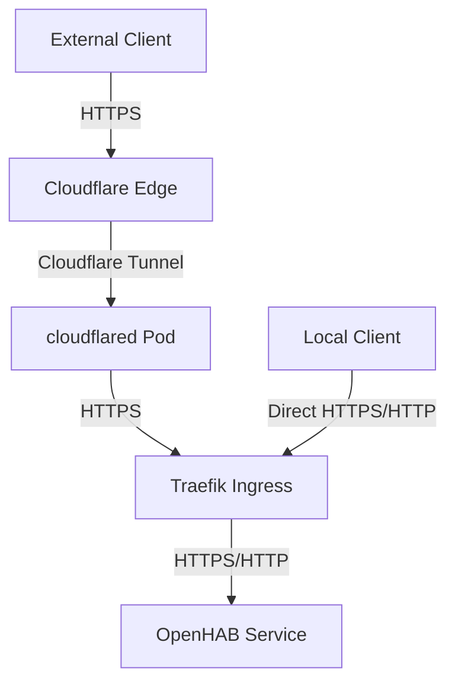
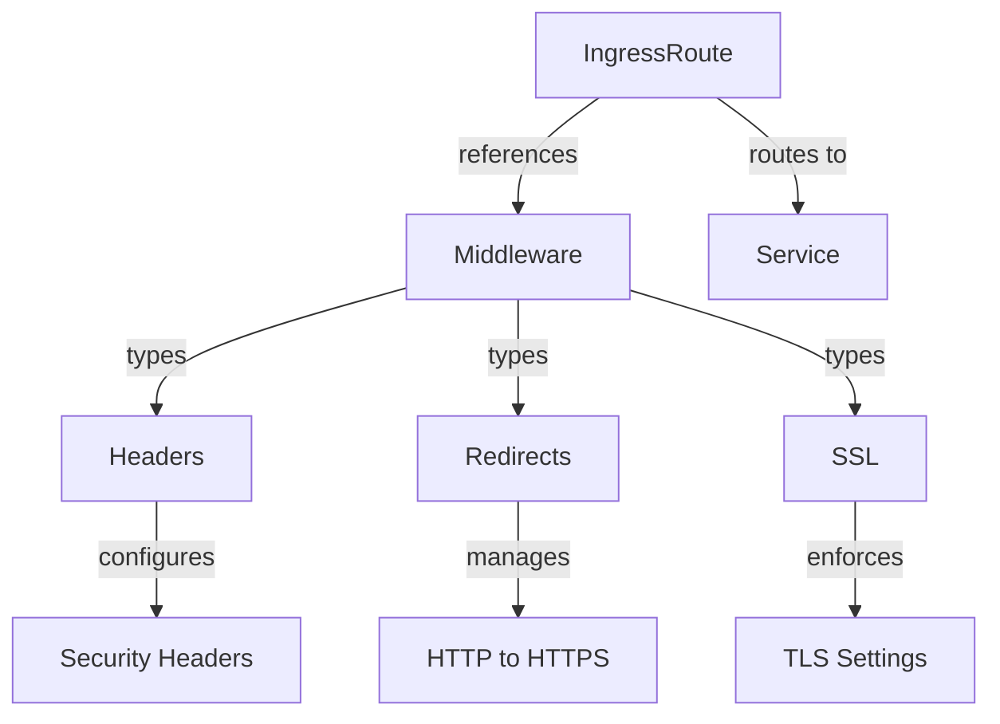
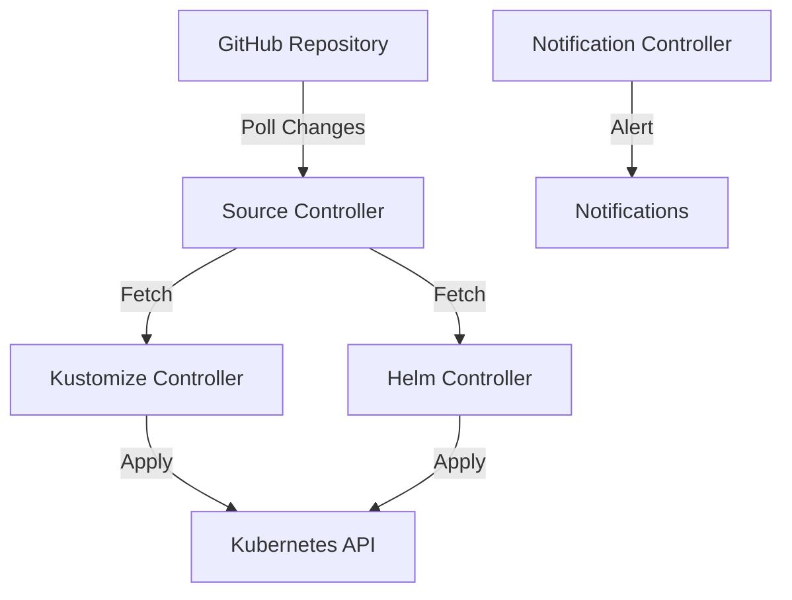

# Home Automation Kubernetes Configuration

This repository contains Kubernetes configurations for deploying home automation applications using FluxCD. Currently includes:

- OpenHAB - Home automation platform
- Mosquitto - MQTT message broker
- Loki - Log aggregation system
- Promtail - Log collection agent

## Prerequisites

- Kubernetes cluster (K3s)
- FluxCD installed
- GitHub repository access

## Installation

1. Install Flux CLI:
```bash
brew install fluxcd/tap/flux
```

2. Check your cluster is ready:
```bash
flux check --pre
```

3. Bootstrap Flux with your GitHub repository:
```bash
flux bootstrap github \
  --owner=jannegpriv \
  --repository=k3s-cluster-config \
  --branch=main \
  --path=clusters/production \
  --personal
```

4. Add the Jetstack Helm repository for cert-manager:
```bash
flux create source helm jetstack \
  --url=https://charts.jetstack.io \
  --namespace=flux-system
```

## Repository Structure

```
clusters/
└── production/
    ├── cert-manager/
    │   ├── cluster-issuer.yaml
    │   ├── kustomization.yaml
    │   ├── namespace.yaml
    │   └── release.yaml
    ├── openhab/
    │   ├── kustomization.yaml
    ├── mosquitto/
    │   ├── mosquitto-claims.yaml
    │   ├── mosquitto-service.yaml
    │   ├── mosquitto-statefulset.yaml
    │   └── kustomization.yaml
    │   ├── openhab-claims.yaml
    │   ├── openhab-service.yaml
    │   ├── openhab-statefulset.yaml
    │   └── openhab-traefik.yaml
    └── flux-system/
        └── kustomization.yaml
```

## Verification

1. Check Flux is syncing:
```bash
flux get kustomizations
```

2. Check cert-manager installation:
```bash
flux get helmreleases -n cert-manager
```

3. Check OpenHAB deployment:
```bash
kubectl get pods
kubectl get ingress
```

## Architecture

### Network Flow



### Component Details

1. **Cloudflare Edge**
   - Handles external TLS termination
   - Provides DDoS protection
   - Manages DNS for openhab.k3s.nu

2. **Cloudflare Tunnel**
   - Runs as a Pod in the `cloudflare` namespace
   - Creates secure outbound connection to Cloudflare
   - No need for public IP or open ports
   - Routes traffic to Traefik using internal service discovery

3. **Traefik Ingress**
   - Handles both external (via Cloudflare) and local traffic
   - Configured using IngressRoute CRDs
   - Manages TLS for direct access
   - Uses middleware for security and routing

4. **Loki**
   - Centralized log aggregation system
   - Stores and indexes logs from all applications
   - Integrates with Grafana for visualization
   - Supports LogQL for powerful log querying

5. **Promtail**
   - Runs as a sidecar container in the openHAB pod
   - Collects and forwards logs to Loki
   - Parses log formats using regex patterns
   - Extracts metadata like log levels and component names

### Traefik Components



### Middleware Explanation

Traefik middleware acts as a series of steps that process requests before they reach your service:

1. **Security Headers Middleware** (`openhab-https`)
   ```yaml
   # Sets critical security headers
   - sslRedirect: true           # Force HTTPS
   - forceSTSHeader: true        # Use Strict Transport Security
   - stsSeconds: 31536000        # HSTS for 1 year
   - stsIncludeSubdomains: true  # Apply to subdomains
   - stsPreload: true            # Allow preloading in browsers
   ```

2. **Protocol Headers**
   - Sets `X-Forwarded-Proto: "https"` to ensure applications know the original protocol

The middleware chain ensures that:
- All traffic is secure
- Security policies are enforced consistently
- Headers are properly set for proxied connections

## Access

OpenHAB can be accessed in two ways:

1. **External Access**: https://openhab.k3s.nu
   - Routes through Cloudflare
   - Full SSL/TLS encryption
   - DDoS protection

2. **Local Access**: http://openhab.k3s.nu
   - Direct access within local network
   - Bypasses Cloudflare
   - Optional HTTPS available

## Monitoring

### Web Interfaces

All services are accessible via `.local` domains. Add the following to your `/etc/hosts`:

```
192.168.50.75  grafana.local prometheus.local alertmanager.local ceph.local kuma.local loki.local headlamp.local weave.local openhab.local
```

| Service | URL | Description |
|---------|-----|-------------|
| **Grafana** | http://grafana.local | Dashboards and visualization |
| **Prometheus** | http://prometheus.local | Metrics and queries |
| **Alertmanager** | http://alertmanager.local | Alert management |
| **Ceph Dashboard** | http://ceph.local | Ceph storage status |
| **Uptime Kuma** | http://kuma.local | Uptime monitoring |
| **Loki** | http://loki.local | Log queries |
| **Headlamp** | http://headlamp.local | Kubernetes UI |
| **Weave GitOps** | http://weave.local | Flux/GitOps UI |

### OpenHAB Logs Dashboard

A specialized Grafana dashboard has been created to monitor openHAB logs:

1. **Features**:
   - Visualizes log volume by log level (ERROR, WARN, INFO, DEBUG, TRACE)
   - Tracks Java exceptions over time with breakdown by exception type
   - Shows most common Java exceptions in a table view
   - Displays recent logs and exceptions in real-time
   - Supports filtering by log level across all panels

2. **Implementation**:
   - Uses Loki as the log data source
   - Promtail sidecar container collects logs from openHAB
   - LogQL queries extract metadata using regex patterns
   - Configured via ConfigMap with Grafana dashboard JSON

## FluxCD Architecture

### Overview



### Components

1. **Source Controller**
   - Monitors Git repositories and Helm repositories
   - Downloads artifacts and verifies checksums
   - Makes artifacts available to other controllers
   - Your sources:
     - Git: `jannegpriv/k3s-cluster-config`
     - Helm: cert-manager, weave-gitops

2. **Kustomize Controller**
   - Watches for `Kustomization` resources
   - Builds and applies kustomizations
   - Prunes resources that are no longer needed
   - Your kustomizations:
     - `/clusters/production/apps`
     - `/clusters/production/infrastructure`

3. **Helm Controller**
   - Manages Helm chart releases
   - Automatically upgrades releases
   - Your releases:
     - cert-manager
     - weave-gitops

4. **Notification Controller**
   - Handles alerts and notifications
   - Can notify about reconciliation failures

## Mosquitto MQTT Broker

The Mosquitto MQTT broker is deployed as a StatefulSet with persistent storage using Rook/Ceph. It provides:

- MQTT protocol support on port 1883
- Persistent message storage
- Direct access through the master node's IP (192.168.50.75:1883)
- Resource limits to ensure stable operation

The deployment consists of:
- StatefulSet with 1 replica
- Persistent storage for configuration, data, and logs
- Service configuration for internal and external access

### Directory Structure Explained

```
clusters/production/
├── apps/                    # Application workloads
│   └── openhab/            # OpenHAB configuration
│       ├── kustomization.yaml     # Resource composition
│       ├── openhab-claims.yaml    # PVC definitions
│       ├── openhab-service.yaml   # Service definition
│       ├── openhab-traefik.yaml   # Ingress configuration
│       └── openhab-statefulset.yaml # Main deployment
├── infrastructure/          # Infrastructure components
│   ├── cert-manager/       # Certificate management
│   ├── cloudflare/         # Cloudflare tunnel
│   └── weave-gitops/       # GitOps UI
└── flux-system/            # Flux core components
```

### GitOps Workflow

1. **Change Process**:
   ```mermaid
   sequenceDiagram
       participant Dev as Developer
       participant Git as GitHub
       participant Flux as FluxCD
       participant K8s as Kubernetes
       
       Dev->>Git: Push changes
       Flux->>Git: Poll for changes
       Flux->>Flux: Validate changes
       Flux->>K8s: Apply changes
       K8s-->>Flux: Report status
       Flux-->>Git: Update status
   ```

2. **Reconciliation**:
   - Flux checks your Git repository every 1 minute
   - Changes are automatically applied
   - Failed changes are reported and retried

### Weave GitOps UI

Access the UI locally at http://weave.local

Make sure your local DNS (e.g., `/etc/hosts`) has an entry for `weave.local` pointing to your K3s cluster IP.

Credentials:
- Username: admin
- Default password: flux (should be changed)

Features:
- Visual cluster overview
- Resource status and health
- Reconciliation logs
- Helm release management

## Secrets Management

This repository uses plain Kubernetes secrets for simplicity. Before deploying, you need to:

1. Update the Cloudflare API token in `clusters/production/infrastructure/cert-manager/cloudflare-secret.yaml`
   ```yaml
   stringData:
       api-token: your-cloudflare-api-token-here
   ```

2. Apply the secret:
   ```bash
   kubectl apply -f clusters/production/infrastructure/cert-manager/cloudflare-secret.yaml
   ```

**Note:** Since this is not a production system, we're using plain Kubernetes secrets committed to the repository. In a production environment, you should use a proper secrets management solution like SOPS, Sealed Secrets, or Vault.

## Rook-Ceph Storage

This cluster uses Rook to manage Ceph storage for persistent volumes. The configuration includes:

- 4 OSDs distributed across worker nodes
- CephFS for file-based storage
- RBD (Ceph Block Device) for block storage
- Replication factor of 2 for data protection while optimizing storage efficiency

### Key Components

1. **CephCluster**
   - Defined in `clusters/production/apps/rook-ceph/ceph-cluster.yaml`
   - Configures the core Ceph cluster settings
   - Includes monitor placement, network settings, and resource limits

2. **CephBlockPool**
   - Defined in `clusters/production/apps/rook-ceph/ceph-block-pool.yaml`
   - Configures the replicapool with a replication factor of 2
   - Used for RWO (ReadWriteOnce) persistent volumes

3. **StorageClass**
   - Provides the interface between Kubernetes PVCs and Ceph storage
   - Automatically provisions storage when PVCs are created

### Storage Management

- **PG Autoscaling**: Enabled by default, automatically manages placement groups
- **Monitoring**: Integrated with Prometheus for storage metrics
- **Data Placement**: Uses CRUSH rules to distribute data across OSDs

### Troubleshooting Ceph

```bash
# Check Ceph cluster status
kubectl -n rook-ceph exec -it deploy/rook-ceph-tools -- ceph status

# Check OSD usage
kubectl -n rook-ceph exec -it deploy/rook-ceph-tools -- ceph osd df

# Check pool details
kubectl -n rook-ceph exec -it deploy/rook-ceph-tools -- ceph osd pool ls detail
```

## Backup Jobs

Automated backup CronJobs are configured for critical applications. Backups are stored on a NAS via SSH/SCP.

| Application | Schedule | Namespace | Destination |
|-------------|----------|-----------|-------------|
| **openHAB** | 02:00 daily | openhab | NAS via SCP |
| **Bitwarden** | 03:00 daily | bitwarden | NAS via SCP |

### Configuration

Both backup jobs:
- Run on `k3s-w-1` (nodeSelector)
- Use `nas-credentials` secret for NAS authentication
- Keep 3 successful job history entries

### Monitoring Backups

```bash
# Check backup CronJobs status
kubectl get cronjobs -A | grep backup

# Check recent backup jobs for openHAB
kubectl -n openhab get jobs | grep backup | tail -5

# Check recent backup jobs for Bitwarden
kubectl -n bitwarden get jobs | grep backup | tail -5

# View logs from last backup job
kubectl -n openhab logs job/$(kubectl -n openhab get jobs --sort-by=.metadata.creationTimestamp | grep backup | tail -1 | awk '{print $1}')
```

### Manual Backup Trigger

```bash
# Trigger openHAB backup manually
kubectl -n openhab create job --from=cronjob/openhab-backup openhab-backup-manual

# Trigger Bitwarden backup manually
kubectl -n bitwarden create job --from=cronjob/bitwarden-backup bitwarden-backup-manual
```

### Restore

For openHAB restore instructions, see `clusters/production/apps/openhab/restore-backup.sh`.

## General Troubleshooting

1. Check Flux logs:
```bash
flux logs
```

2. Check cert-manager status:
```bash
kubectl get certificates,certificaterequests
```

3. Check OpenHAB pods:
```bash
kubectl describe pod -l app=openhab-production
```
